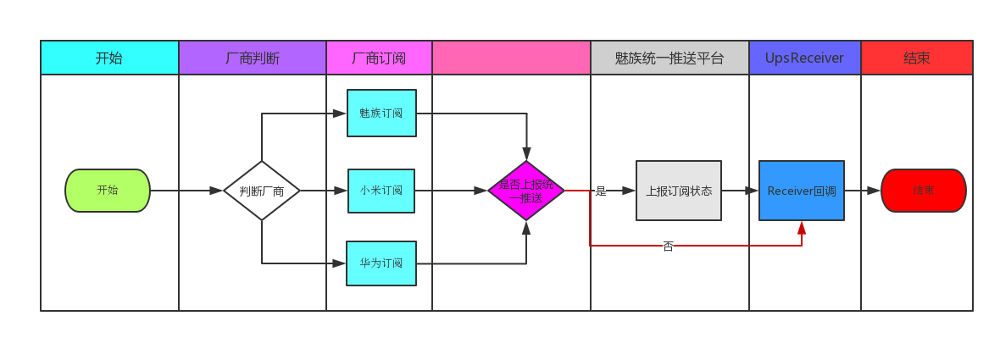

# 集成推送平台PushSDK设计文档

此文档在于向开发者介绍魅族统一推送平台PushSDK如何对各个厂家的PushSDK进行整合以及我们在统一接口设计中遵循的规则，由于各个厂家的API接口
功能差异巨大我们只对各个厂商共用的接口进行统一封装，当然你也可以直接使用厂商提供的接口。UpsPushSDK设计初衷不仅仅是在帮助开发者接入魅族的统一推送
平台，也希望我们能够尽量简化接口的同时，能够将厂商所有的个性化接口全部提供给开发者，即使开发者不使用魅族统一推送平台也能通过各个厂商提供
推送服务平台快速接入。

## 背景
目前各个主流厂商为了优化手机耗电情况,实行静默后台策略,导致很多应用无法常驻后台,导致基于长连接的推送应用也无法常驻后台
进而影响推送消息的到达率,因此各个主流厂商(小米,华为,魅族)都提供基于系统推送服务的方案,应用需要接入各个厂商的PushSDK
才能在各个平台的手机上接收推送消息.此项目为了屏蔽不同厂商PushSDK的接入流程,为开发这提供统一的接口,方便开发者一次集成
 即可完成不同厂商的PushSDK的接入.

## 一 接入说明 

接入文档[详见](UpsIntegrateReadme.md)
 
## 二 接口说明

为了统一接入方式,ups-meizu-pushsdk沿用魅族pushSDK的接口的定义方式,其主要包括UpsPushManager功能入口类和接收消息
回调的广播回调类UpsPushReceiver.

### 2.1 UpsPushManager 接入类

| 接口名称      | 接口说明| 使用建议|是否已经废弃|对应UpsPushReceiver回调方法|
| :--------: | :--------:| :--: |:--: |:--: |
|register(Context context,String appId,String appKey)|订阅接口|建议Application onCreate调用|否|onUpsCommandResult(Context context, UpsCommandMessage upsCommandMessage)|
|unRegister(Context context)|反订阅接口|取消所有推送时使用,慎用,如果取消,将有可能停止所有推送|否|onUpsCommandResult(Context context, UpsCommandMessage upsCommandMessage)|
|subScribeAlias(Context context,String alias)|订阅别名|无|否|onUpsCommandResult(Context context, UpsCommandMessage upsCommandMessage)|
|unSubScribeAlias(Context context,String alias)|取消别名|无|否|onUpsCommandResult(Context context, UpsCommandMessage upsCommandMessage)|

### 2.2 UpsPushMessageReceiver 广播接收器 

UpsPushMessageReceiver是一个抽象的BroadcastReceiver类，为了统一各个厂商的回调，必须定义通用的方法，在包装数据格式时只是原样返回，不做任何修饰，
里面定义了五个方法，分别为`onThroughMessage`,`onNotificationClicked`,`onNotificationArrived`,`onNotificationDeleted`,`onUpsCommandResult`
 
 
| 接口名称      | 接口说明| 使用建议|是否已经废弃|
| :--------: | :--------:| :--: |:--: |
|onThroughMessage(Context context,UpsPushMessage upsPushMessage)| 透传消息回调|跟上面方法两者选其一实现,不要两个方法同时覆盖,否则一次透传消息会回调两次,此方法多一个平台参数,格式如下格式如下:```{"task_id":"1232"}```|否|                                                                                  
|onNotificationClicked(Context context, UpsPushMessage upsPushMessage)|通知栏点击回调|无|否|
|onNotificationArrived(Context context, UpsPushMessage upsPushMessage)|通知栏展示回调|Flyme6基于android6.0不再回调|否|
|onNotificationDeleted(Context context, UpsPushMessage upsPushMessage)|通知栏删除回调|Flyme6基于android6.0不再回调|否|
|onUpsCommandResult(Context context, UpsCommandMessage upsCommandMessage)||无|否|


##  三 UPSManager API 详细说明

### 3.1 public static void register(Context context,String appId,String appKey)

注册统一推送服务，建议在应用启动时调用

| 参数列表      | 参数说明| 
| :--------: | :--------:| 
|context| Android平台上app的上下文，建议传入当前app的application context|                                                                                
|appId|应用在统一集成平台申请的appid|
|appKey|应用在统一集成平台申请的appKey|

### 3.2 public static void unRegister(Context context)

反订阅推送服务,关闭推送时使用

| 参数列表      | 参数说明| 
| :--------: | :--------:| 
|context| Android平台上app的上下文，建议传入当前app的application context|                                                                                

### 3.3 public static void subScribeAlias(Context context,String alias)

| 参数列表      | 参数说明| 
| :--------: | :--------:| 
|context| Android平台上app的上下文，建议传入当前app的application context|                                                                                
|alias|应用别名|

### 3.4 public static void unSubScribeAlias(Context context,String alias)

| 参数列表      | 参数说明| 
| :--------: | :--------:| 
|context| Android平台上app的上下文，建议传入当前app的application context|                                                                                
|alias|应用别名|


## 四 UpsPushMessageReceiver 回调方法详细说明

### 4.1 public void onThroughMessage(Context context,UpsPushMessage upsPushMessage)

接收透传消息回调

**NOTE:** 参数说明

| 参数列表      | 参数说明| 
| :--------: | :--------:| 
|context| Android平台上app的上下文，建议传入当前app的application context|                                                                                
|upsPushMessage|服务端返回的结果全部封装在upsPushMessage对象中，可以从对象中和获取例如`content` `title` `extra` `pushType` `company`|

**NOTE:** UpsPushMessage 参数说明
在设计UpsPushMessage时我们尽量保证将厂商提供的参数信息回调给用户，方便开发者能够使用各个厂商的个性化功能

| 参数名      | 参数说明| 
| :--------: | :--------:| 
|title|消息的标题，如果时通知栏消息，则为通知栏标题|
|content|消息内容,如果时通知栏则为消息通知栏内容，如果为透传消息，则为透传消息体|
|pushType|消息类型,0代表通知栏消息，1代表透传消息|
|company|厂商类型包括：UpsPushMessage.MEIZU,UpsPushMessage.HUAWEI,UpsPushMessage.XIAOMI|
|extra|代表各个平台的传递的对象，魅族代表selfDefineContentString，小米代表MiPushMessage，华为代表bundle,需要通过判断company进行对象类型转化，如下：|

```
    if(company==UpsPushMessage.MEIZU){ 
        string extra = extra;
    } else if(company==UpsPushMessage.XIAOMI){
        MiPushMessage miPushMssage = (MiPushMessage)extra;
    } else if(company==UpsPushMessage.HUAWEI){
        Bundle bundle = (Bundle)extra;
    }
```

### 4.2 public void onNotificationClicked(Context context, UpsPushMessage upsPushMessage)

接收通知栏消息点击回调

| 参数列表      | 参数说明| 
| :--------: | :--------:| 
|context| Android平台上app的上下文，建议传入当前app的application context|                                                                                
|upsPushMessage|服务端返回的结果全部封装在upsPushMessage对象中，可以从对象中和获取例如`content` `title` `extra` `pushType` `company`|

**NOTE:** UpsPushMessage 参数说明
在设计UpsPushMessage时我们尽量保证将厂商提供的参数信息回调给用户，方便开发者能够使用各个厂商的个性化功能

| 参数名      | 参数说明| 
| :--------: | :--------:| 
|title|消息的标题，如果时通知栏消息，则为通知栏标题|
|content|消息内容,如果时通知栏则为消息通知栏内容，如果为透传消息，则为透传消息体|
|pushType|消息类型,0代表通知栏消息，1代表透传消息|
|company|厂商类型包括：UpsPushMessage.MEIZU,UpsPushMessage.HUAWEI,UpsPushMessage.XIAOMI|
|extra|代表各个平台的传递的对象，魅族代表selfDefineContentString，小米代表MiPushMessage，华为代表bundle,需要通过判断company进行对象类型转化，如下：|

```
    if(company==UpsPushMessage.MEIZU){ 
        string extra = extra;
    } else if(company==UpsPushMessage.XIAOMI){
        MiPushMessage miPushMssage = (MiPushMessage)extra;
    } else if(company==UpsPushMessage.HUAWEI){
        Bundle bundle = (Bundle)extra;
    }
```
### 4.3 public void onNotificationArrived(Context context, UpsPushMessage upsPushMessage)

接收通知栏消息到达回调

| 参数列表      | 参数说明| 
| :--------: | :--------:| 
|context| Android平台上app的上下文，建议传入当前app的application context|                                                                                
|upsPushMessage|服务端返回的结果全部封装在upsPushMessage对象中，可以从对象中和获取例如`content` `title` `extra` `pushType` `company`|

**NOTE:** UpsPushMessage 参数说明
在设计UpsPushMessage时我们尽量保证将厂商提供的参数信息回调给用户，方便开发者能够使用各个厂商的个性化功能

| 参数名      | 参数说明| 
| :--------: | :--------:| 
|title|消息的标题，如果时通知栏消息，则为通知栏标题|
|content|消息内容,如果时通知栏则为消息通知栏内容，如果为透传消息，则为透传消息体|
|pushType|消息类型,0代表通知栏消息，1代表透传消息|
|company|厂商类型包括：UpsPushMessage.MEIZU,UpsPushMessage.HUAWEI,UpsPushMessage.XIAOMI|
|extra|代表各个平台的传递的对象，魅族代表selfDefineContentString，小米代表MiPushMessage，华为代表bundle,需要通过判断company进行对象类型转化，如下：|

```
    if(company==UpsPushMessage.MEIZU){ 
        string extra = extra;
    } else if(company==UpsPushMessage.XIAOMI){
        MiPushMessage miPushMssage = (MiPushMessage)extra;
    } else if(company==UpsPushMessage.HUAWEI){
        Bundle bundle = (Bundle)extra;
    }
```

### 4.4 public void onNotificationDeleted(Context context, UpsPushMessage upsPushMessage)

接收通知栏消息删除回调

| 参数列表      | 参数说明| 
| :--------: | :--------:| 
|context| Android平台上app的上下文，建议传入当前app的application context|                                                                                
|upsPushMessage|服务端返回的结果全部封装在upsPushMessage对象中，可以从对象中和获取例如`content` `title` `extra` `pushType` `company`|

**NOTE:** UpsPushMessage 参数说明
在设计UpsPushMessage时我们尽量保证将厂商提供的参数信息回调给用户，方便开发者能够使用各个厂商的个性化功能

| 参数名      | 参数说明| 
| :--------: | :--------:| 
|title|消息的标题，如果时通知栏消息，则为通知栏标题|
|content|消息内容,如果时通知栏则为消息通知栏内容，如果为透传消息，则为透传消息体|
|pushType|消息类型,0代表通知栏消息，1代表透传消息|
|company|厂商类型包括：UpsPushMessage.MEIZU,UpsPushMessage.HUAWEI,UpsPushMessage.XIAOMI|
|extra|代表各个平台的传递的对象，魅族代表selfDefineContentString，小米代表MiPushMessage，华为代表bundle,需要通过判断company进行对象类型转化，如下：|

```
    if(company==UpsPushMessage.MEIZU){ 
        string extra = extra;
    } else if(company==UpsPushMessage.XIAOMI){
        MiPushMessage miPushMssage = (MiPushMessage)extra;
    } else if(company==UpsPushMessage.HUAWEI){
        Bundle bundle = (Bundle)extra;
    }
```

### 4.5 public void onUpsCommandResult(Context context, UpsCommandMessage upsCommandMessage)

接收订阅，反订阅，别名订阅，取消别名订阅回调


| 参数列表      | 参数说明| 
| :--------: | :--------:| 
|context| Android平台上app的上下文，建议传入当前app的application context|                                                                                
|upsCommandMessage|服务端返回的结果全部封装在upsCommandMessage对象中，可以从对象中和获取例如code,message,commandType,commandResult|

**NOTE:** UpsCommandMessage具体参数说明
 
 | 参数名      | 参数说明| 
 | :--------: | :--------:| 
 |code|表示订阅，反订阅的返回码,如果成功，即返回UPS.SUCCESS==200,否则返回错误状态码|
 |message|表示执行请求返回的成功与错误信息|
 |commandType|表示请求服务类型,目前包括四种UpsManager.REGISTER,UpsManager.UNREGISTER,UpsManager.SUBALIAS,UpsManager.UNSUBALIAS|
 |commandResult|表示执行成功后，服务端返回的结果参数，例如订阅成功后，返回的pushId.|
 |company|厂商类型包括：UpsPushMessage.MEIZU,UpsPushMessage.HUAWEI,UpsPushMessage.XIAOMI|
 |extra|代表各个平台传递对象，魅族为空，小米为MiPushCommandMessage，华为为Bundle，需要通过company进行类型转换如下代码：|
 
 ```
 if(company==UpsPushMessage.MEIZU){ 
         string extra = extra;
     } else if(company==UpsPushMessage.XIAOMI){
         MiPushCommandMessage miPushCommandMessage = (MiPushCommandMessage)extra;
     } else if(company==UpsPushMessage.HUAWEI){
         Bundle bundle = (Bundle)extra;
     }
 ```


## 五 技术实现
 
### 5.1 UpsManager 接口代理
 
 UpsManager调用的定义的API最终会调用各个厂商提供的API,我们展示屏蔽了具体进行厂商判断的细节，以及对接魅族统一推送平台的接口。
 以下为订阅逻辑的逻辑图:
 

 
 具体步骤基本和厂商sdk的逻辑一致，只是增加了上报魅族统一推送平台订阅状态的逻辑，该逻辑我们可以考虑是否支持上报，即使此步骤执行不成功，UpsReceiver也会回调
 各个厂商的状态，完全不必担心此逻辑会影响厂商的具体的订阅发起与回调逻辑。
 
 **NOTE:** 以上步骤值讨论了订阅的逻辑，其他如别名订阅与此大致一致。